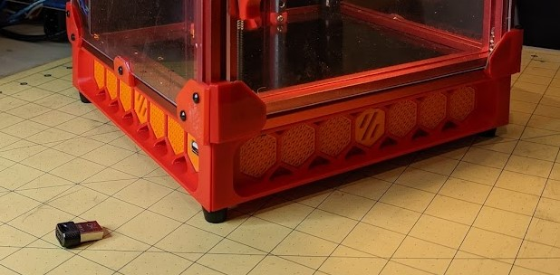
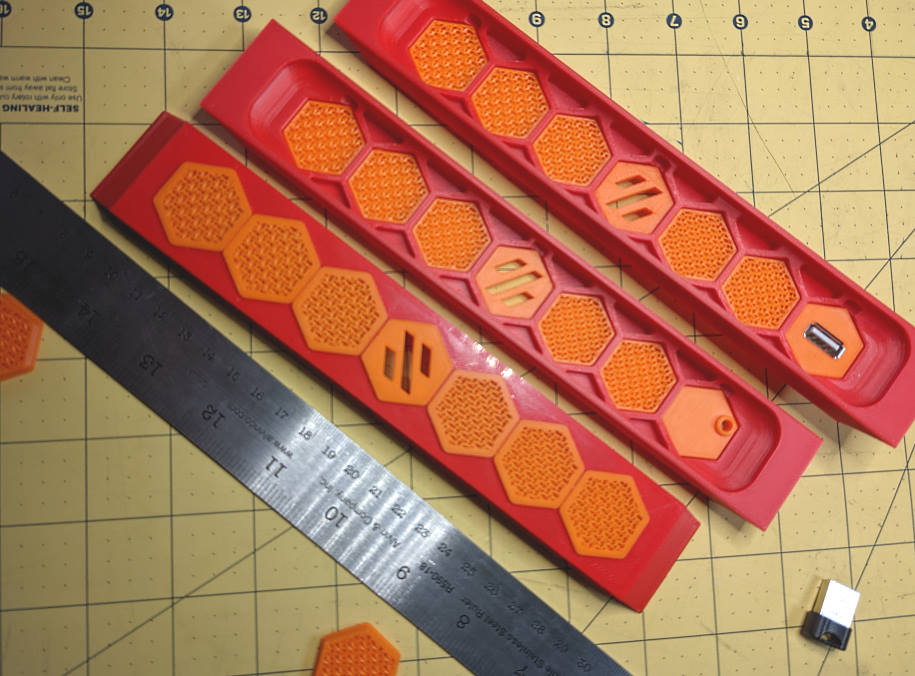
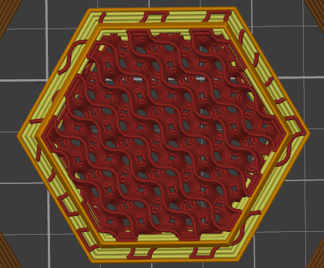

# Voron 0 Modular Skirt Mod

- Inspired by Trident skirt design

- Supports modular hexagon inserts

- Hexagons available: Blank, Logo, USB-A, Reverse Bowden, Keystone (soon)

## Installation

The skirts need only 3 mounting points and reuse stock bom hardware.

## Printing Modules

The modules tend to snap into place better with fewer perimeters. Most modules can be printed face down or back down.

### Printing blank modules with fun infill patterns

I recommend you get creative when printing the blank modules to allow for some extra airflow. Here is my favorite multiprocess method:
- 2 perimeters, 0 top, 0 bottom, 28% gyroid
- Height range modifier 0 - 1.0mm, 5 perimeters, 2 top

